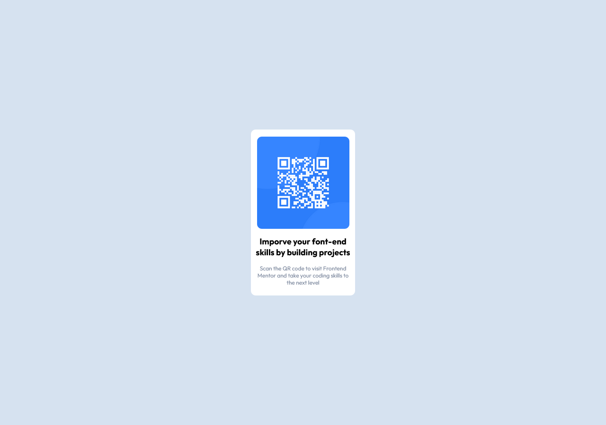

# Frontend Mentor - QR code component solution

This is a solution to the [QR code component challenge on Frontend Mentor](https://www.frontendmentor.io/challenges/qr-code-component-iux_sIO_H). Frontend Mentor challenges help you improve your coding skills by building realistic projects. 

## Table of contents

- [Overview](#overview)
  - [Screenshot](#screenshot)
  - [Links](#links)
- [My process](#my-process)
  - [Built with](#built-with)
  - [What I learned](#what-i-learned)
  - [Continued development](#continued-development)
  - [Useful resources](#useful-resources)
- [Author](#author)
- [Acknowledgments](#acknowledgments)

**Note: Delete this note and update the table of contents based on what sections you keep.**

## Overview

### Screenshot

### Links

- Solution URL: [Add solution URL here](https://your-solution-url.com)
- Live Site URL: [Add live site URL here](https://your-live-site-url.com)

## My process

### Built with

- Classy HTML
- CSS custom properties
- Flexbox
- SCSS

**Note: These are just examples. Delete this note and replace the list above with your own choices**

### What I learned

I've never thought about using padding and margin at this large scale.
But it came as a good idea to use all of that for most properties.
That is annoying at first, But it's finally completed,
It took me approximately 2-3 hours to finish it with some simple div without html5.

### Continued development

Amm, I'm gonna put some efforts on understanding Box modals and padding and margin.

### Useful resources

- [Youtube Video](https://www.youtube.com/watch?v=Qhaz36TZG5Y) - This helped me understand some missing concepts during the creation of that project, especially the part of the Firefox browser box modal.
- [W3Schools](https://www.w3schools.com/tags/tag_main.asp) - This was a great help with HTML5 as you saw in commented section 

## Author

- GitHub - [Ahmed Zaki](https://github.com/AhmedZakii2)
- Frontend Mentor - [@wendlinzak](https://www.frontendmentor.io/profile/wendlinzak)
